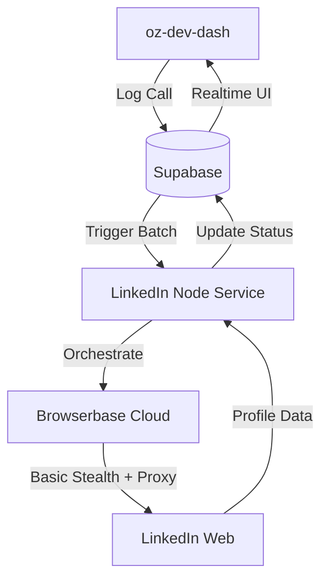

# LinkedIn Automation System Documentation

This document provides a comprehensive overview of the LinkedIn automation system built for OZL, including the original implementation plan, architecture details, and setup instructions.

---

## 🚀 Feature Overview

The LinkedIn Automation System replaces the legacy PhantomBuster integration with a custom, stealth-focused solution. It leverages **Browserbase** and **Stagehand** to automate prospect discovery and connection requests directly from the OZL workflow.

### Key Logic
- **Daily Batch Searches (6:00 PM)**: Automatically searches for profiles for all calls logged during the day.
- **Daily Batch Connections (6:30 PM)**: Sends connection requests with custom message templates for all user-approved profiles.
- **Stealth Integration**: Uses residential proxies and Browserbase's stealth mode to bypass LinkedIn detection.
- **Frontend Dashboard**: A new tab in the prospect detail view allows users to select profiles and monitor their automation queue.

---

## 🏗️ Architecture

### Components
1. **Backend Service**: `ozl-backend/services/linkedin-automation`
2. **Frontend Tab**: `oz-dev-dash/src/components/prospects/LinkedInTab.tsx`
3. **Database Migration**: `20260206100000_linkedin_search_results.sql`

---

## 🛠️ Setup Guide

### 1. Environment Variables
Configure the following in `services/linkedin-automation/.env`:
- `BROWSERBASE_API_KEY`: API key from Browserbase dashboard.
- `BROWSERBASE_PROJECT_ID`: Project ID from Browserbase.
- `JEFF_LINKEDIN_COOKIE`: The `li_at` cookie for the user.
- `SEARCH_CRON_SCHEDULE`: Cron expression (e.g., `0 18 * * *`).

### 2. LinkedIn Cookie Extraction
1. Login to LinkedIn in your browser.
2. Open DevTools (F12) -> Application -> Cookies.
3. Find the `li_at` cookie and copy its value.
4. Paste it into the corresponding `.env` variable.

---

## 📜 Original Implementation Plan (Archive)

Below is the full implementation plan as drafted during the design phase.

### Overview
Building a custom LinkedIn automation system to replace PhantomBuster integration in the OZL prospects flow. The system will use **Browserbase** with their **Stagehand** library to search for prospects on LinkedIn and semi-automatically send connection requests with custom messages.

### Key Challenges & Approach
1. **Bot Detection**: LinkedIn has sophisticated anti-automation systems. We'll use Browserbase's Advanced Stealth Mode with residential proxies and human-like behavior patterns.
2. **Rate Limiting**: Implement intelligent queuing and delay systems to avoid triggering LinkedIn's rate limits.
3. **Technology Stack**: Since ozl-backend is Python/FastAPI and Stagehand is Node.js/TypeScript, we'll create a new Node.js microservice.
4. **User Experience**: Changed from fully automated to semi-automated: search results are shown to the user who manually selects the correct profile before connection.

### User Review Required
- **Cost Implications**: Browserbase Developer plan starts at $20/month.
- **LinkedIn Account Risk**: Always a risk when automating. Mitigation includes stealth mode, residential proxies, and human-like delays.

### Final Implementation Details
- **Microservice**: Node.js worker with `node-cron`.
- **Search Logic**: Stagehand naturally navigates to search, extracts up to 5 profiles, and saves them to `linkedin_search_results`.
- **Connection Logic**: User selects a profile in the UI, setting status to `connection_pending`. The 6:30 PM batch session logs in, navigates to the profile, clicks connect, adds the custom note, and sends.

### Verification Plan
- **Test 1**: LinkedIn Search - Verify profiles appear in the UI after the 6:00 PM batch or manual trigger.
- **Test 2**: Connection Request - Verify LinkedIn "invited" status after the 6:30 PM batch.
- **Test 3**: Stealth - Monitor for CAPTCHAs (none expected with current delays).
